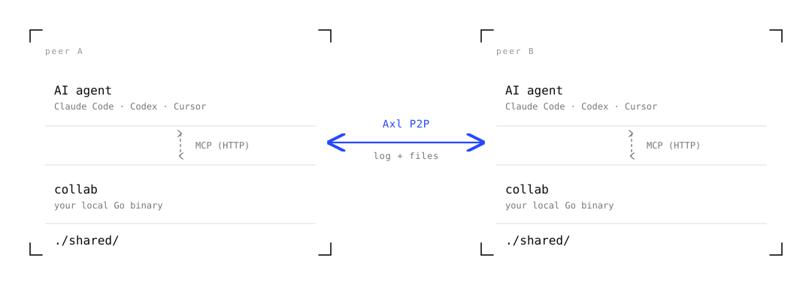

<p align="center">
  <picture>
    <source media="(prefers-color-scheme: dark)" srcset="web/banner-dark.svg">
    
  </picture>
</p>

<p align="center">
  Pair on Claude Code (or any MCP-capable agent) across machines, across
  networks, with no hosted platform. Each developer brings their own agent
  and their own API key.
</p>

<p align="center">
  <a href="https://aman035.github.io/collab-ai/"><strong>Website</strong></a>
  &nbsp;·&nbsp;
  <a href="#install">Install</a>
  &nbsp;·&nbsp;
  <a href="#use">Use</a>
  &nbsp;·&nbsp;
  <a href="#architecture">Architecture</a>
</p>

<p align="center">
  <a href="https://github.com/Aman035/collab-ai/releases"></a>
  <a href="LICENSE"></a>
</p>

---

## What it is

<p align="center">
  <picture>
    <source media="(prefers-color-scheme: dark)" srcset="web/architecture-dark.svg">
    
  </picture>
</p>

Two channels cross the network and nothing else:

- **Shared conversation log** (G-Set CRDT keyed by ULID). Every
  `post_to_log` from any peer's agent shows up via `get_shared_log`
  on every other peer's agent. `ask_peer` and `respond_to_peer` add
  direct, targeted requests that one agent makes of another.
- **`./shared/`**. Files dropped here propagate via fsnotify, merged
  with a per-file LWW-Register CRDT (add-wins on concurrent edit + delete),
  capped at 256 KB per file.

Everything else stays local: API keys, files outside `./shared/`,
environment variables, your agent's tool-call results.

## Install

One curl. The Gensyn Axl daemon auto-builds into `~/.collab/bin/` on
first session, so there is no second binary to chase.

```bash
curl -sSL https://raw.githubusercontent.com/Aman035/collab-ai/main/install.sh | sh
```

Or build from source:

```bash
go install github.com/Aman035/collab-ai/cmd/collab@latest
```

Requires Go 1.22+ and `git` (used once, on the first Axl bootstrap).
Prebuilt binaries for darwin / linux × amd64 / arm64 ship with every
[release](https://github.com/Aman035/collab-ai/releases).

## Use

### Single machine

Two terminal tabs. Tab A:

```bash
collab create alice
```

Copy the invite from the TUI. Tab B:

```bash
collab join COLLAB-...  bob
```

Both TUIs show each other in the peer roster. Press `[a]` in either to
launch Claude. Ask Claude to `post_to_log "hello"` and the other tab's
Claude sees it via `get_shared_log`.

### Two machines (e.g. SSH)

On the host server:

```bash
collab create alice --public-addr tls://server1.example.com:9001
```

The invite embeds that address. On the joiner server:

```bash
collab join COLLAB-...  bob
```

The joiner's Axl daemon dials `server1.example.com:9001` automatically.
Make sure port 9001 on the host is reachable from the joiner (security
group or firewall rule).

### What the TUI looks like

```
╭───────────────────────────────────────────────────────────────────────────────╮
│  collab  ·  sleek-platypus  ·  host                          you are alice   │
│                                                                               │
│  ▎ INVITE                                                                     │
│    COLLAB-eae0761a…6c61-5768dd24ea-dGxzOi8vc2Vy…                              │
│      press [c] to copy                                                        │
│                                                                               │
│  ▎ PEERS (2)                       ▎ LOG (3)                                  │
│    ●  alice  · you                   14:32  bob: cache.go has off-by-one      │
│       writing the test harness       14:33  alice ?→bob: review widget.go?    │
│    ●  bob    · joined 4m ago         14:33  bob ←answer: lgtm, ship it        │
│       reviewing widget.go                                                     │
│                                                                               │
│  ▎ SHARED FILES (2)                                                           │
│    cache.go    2.4KB  · from bob · 30s ago                                    │
│    widget.go   1.1KB  · from alice · 12s ago                                  │
│                                                                               │
│  [a] launch claude    [c] copy invite    [j/k] scroll log    [q] quit         │
╰───────────────────────────────────────────────────────────────────────────────╯
```

## What the agent can do

Five MCP tools land in the launched Claude session, auto-discovered via
the per-session `CLAUDE.md` collab writes for it:

| Tool | What it does |
|---|---|
| `get_shared_log` | Read every entry: your own posts, peers' posts, plus `ask_peer` questions and answers. Call at session start to inherit context. |
| `post_to_log` | Broadcast a message to every peer's agent. |
| `ask_peer(target_peer, question)` | Direct a question at one peer's agent. They see it tagged in their log and respond with `respond_to_peer`. |
| `respond_to_peer(question_id, answer)` | Answer a question another peer's agent asked you. |
| `set_status(status)` | Update your "what I'm doing" line. Appears under your handle in everyone's TUI. |
| `list_shared_files` | What's in `./shared/` right now. |

## Verbs

```
collab create [name] [--public-addr ...] [--listen ...]   start a session
collab join <invite> [name]                                join one
collab status                                              peers + counts (read-only)
collab export --out file.json                              dump the log as JSON
collab help [verb]                                         per-command help
collab version                                             build info
```

## How it works

When you `collab create`:

1. Allocate a session dir at `~/collab/<auto-name>/`. The agent runs
   here; `./shared/` is the synced subdir.
2. Spawn the Axl daemon (auto-built from source on first run into
   `~/.collab/bin/axl-node`). Listens on `tls://0.0.0.0:9001` by default.
3. Mint an invite: `COLLAB-<peer_id>-<token>-<addr_b64>`.
4. Start an HTTP MCP server on a random local port. collab is the
   parent, the agent is the child.
5. Register the MCP server at user-scope via `claude mcp add`. No
   per-project approval prompt.
6. Write `CLAUDE.md` into the session dir so the agent boots aware of
   the available tools and when to use them.
7. Open the TUI. Press `[a]` and Claude launches with cwd = session dir.

## Architecture

The two-peer view, repeated from the top, is the simplest mental model:
two collab binaries talking over Axl, each one an MCP bridge to its
local agent.

<p align="center">
  <picture>
    <source media="(prefers-color-scheme: dark)" srcset="web/architecture-dark.svg">
    
  </picture>
</p>

Inside one peer, the work is split across five small Go packages.
Each layer talks to the layer immediately below it through a Go
interface, so the transport (and the agent it bridges to) is
swappable.

<p align="center">
  <picture>
    <source media="(prefers-color-scheme: dark)" srcset="web/architecture-stack-dark.svg">
    
  </picture>
</p>

Supporting packages: `internal/tui` (bubbletea session view),
`internal/handle` (fun-name generator), `internal/bootstrap`
(first-time Axl install), `internal/state` (the
`~/.collab/state.json` snapshot that powers `collab status`).

For the full layer-by-layer breakdown including CRDT semantics, wire
protocol, and failure modes, see
[`docs/02-architecture.md`](docs/02-architecture.md).

## License

[MIT](LICENSE)

[axl]: https://github.com/gensyn-ai/axl
