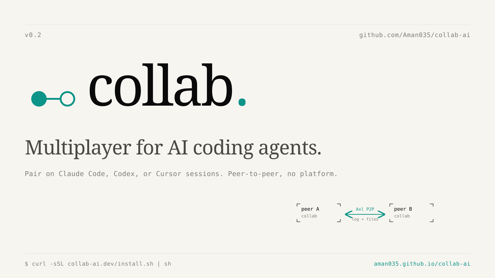

<p align="center">
  <picture>
    <source media="(prefers-color-scheme: dark)" srcset="web/banner-dark.svg">
    
  </picture>
</p>

<p align="center">
  <a href="https://aman035.github.io/collab-ai/"><strong>Website</strong></a>
  &nbsp;·&nbsp;
  <a href="#install">Install</a>
  &nbsp;·&nbsp;
  <a href="#how-to-use">How to use</a>
  &nbsp;·&nbsp;
  <a href="#architecture">Architecture</a>
</p>

<p align="center">
  <a href="https://github.com/Aman035/collab-ai/releases"></a>
  <a href="LICENSE"></a>
</p>

---

## Problem Statement

AI coding agents are single-player. Real engineering (debugging, code
review, mentorship, incident response) is rarely solo work. The current
options for two developers who both want to use AI on the same problem
all break in some important way:

1. **Screen-share is passive.** One person drives, the other watches. The
   observer can't ask their own question without interrupting the driver's
   flow, and only one agent is doing real work.
2. **Shared accounts break the rules.** Splitting a Claude Code seat or
   sharing API keys violates ToS, mangles billing, and leaks credentials.
3. **Async git loses the live reasoning.** By the time the diff lands in
   a PR, the chain of thought that produced it is already gone.
4. **Pasting transcripts into Slack** goes stale by the time anyone reads
   it, and a wall of agent text is unreadable in chat.

The deeper tension: developers want **shared context** (everyone sees the
same problem and code) but need **independent agency** (each person asks
their own questions, uses their own quota). Centralized solutions require
a hosted platform, which means lock-in, privacy concerns, and platform
risk.

## Solution & Use Cases

`collab` is a small Go CLI that gives every developer their own AI agent
plus a shared pair-programming channel between agents. Peer-to-peer over
[Gensyn Axl][axl]. No central server, no shared accounts.

Two channels cross the wire and nothing else:

- **A shared conversation log** (G-Set CRDT, ULID-keyed). Every
  `post_to_log` from any peer's agent appears in every other peer's
  `get_shared_log`. `ask_peer` and `respond_to_peer` add direct, targeted
  requests one agent makes of another.
- **A shared `./shared/` directory.** Files dropped here propagate via
  fsnotify, merged with a per-file LWW-Register CRDT (add-wins on
  concurrent edit + delete, capped at 256 KB per file).

Everything else stays local: API keys, files outside `./shared/`,
environment, your agent's tool-call results.

<p align="center">
  
</p>

**Concrete use cases:**

- **Two-developer debugging across machines.** Senior + junior hit a prod
  bug. Both join the session, each agent explores a different part of the
  codebase, findings get posted to the shared log, and the diff lands in
  `./shared/`.
- **Live code review with two agents.** Reviewer's agent reads the diff
  and posts comments to the log. Author's agent reads them, addresses
  them, posts back. Files and proposed fixes flow through `./shared/`.
- **Async handoff across timezones.** Developer A works during their day,
  posting context + decisions + scratch files. Developer B wakes up,
  joins the session, and their agent inherits the full backlog via
  initial-state replay (not a stale PR + Slack thread).
- **Mixed-agent coordination.** One developer on Claude Code, another on
  Codex, third on Cursor. The protocol is agent-agnostic; collab is the
  wire between any MCP-capable agents.
- **Incident response.** Three on-call engineers in one session, three
  agents exploring three hypotheses simultaneously. First one to find the
  root cause posts; everyone's context updates.
- **Mentorship.** Instructor's agent does real work; student's agent
  handles basics; student watches the senior reasoning unfold via
  `get_shared_log` rather than over a Zoom screen-share.

## Architecture

Inside one peer, the work is split across five small Go packages. Each
layer talks to the layer immediately below it through a Go interface, so
the transport (and the agent it bridges to) is swappable.

<p align="center">
  <picture>
    <source media="(prefers-color-scheme: dark)" srcset="web/architecture-stack-dark.svg">
    
  </picture>
</p>

For the full layer-by-layer breakdown including CRDT semantics, wire
protocol, and failure modes, see
[`docs/02-architecture.md`](docs/02-architecture.md).

## Install

One curl. The Gensyn Axl daemon auto-builds into `~/.collab/bin/` on the
first session, so there's no second binary to chase.

```bash
curl -sSL https://raw.githubusercontent.com/Aman035/collab-ai/main/install.sh | sh
```

Or build from source:

```bash
go install github.com/Aman035/collab-ai/cmd/collab@latest
```

Requires Go 1.22+ and `git` (used once, on the first Axl bootstrap).
Prebuilt binaries for darwin / linux × amd64 / arm64 ship with every
[release](https://github.com/Aman035/collab-ai/releases).

## How to Use

### Single machine

Two terminal tabs. Tab A:

```bash
collab create alice
```

Copy the invite from the TUI. Tab B:

```bash
collab join COLLAB-...  bob
```

Both TUIs show each other in the peer roster. Press `[a]` in either to
launch your AI agent. Ask Claude to `post_to_log "hello"` and the other
tab's Claude sees it via `get_shared_log`.

### Two machines (e.g. SSH)

On the host server:

```bash
collab create alice --public-addr tls://server1.example.com:9001
```

The invite embeds that address. On the joiner server:

```bash
collab join COLLAB-...  bob
```

The joiner's Axl daemon dials `server1.example.com:9001` automatically.
Make sure port 9001 on the host is reachable from the joiner (security
group / firewall rule).

### What the TUI looks like

```
╭───────────────────────────────────────────────────────────────────────────────╮
│  collab  ·  sleek-platypus  ·  host                          you are alice   │
│                                                                               │
│  ▎ INVITE                                                                     │
│    COLLAB-eae0761a…6c61-5768dd24ea-dGxzOi8vc2Vy…                              │
│      press [c] to copy                                                        │
│                                                                               │
│  ▎ PEERS (2)                       ▎ LOG (3)                                  │
│    ●  alice  · you                   14:32  bob: cache.go has off-by-one      │
│       writing the test harness       14:33  alice ?→bob: review widget.go?    │
│    ●  bob    · joined 4m ago         14:33  bob ←answer: lgtm, ship it        │
│       reviewing widget.go                                                     │
│                                                                               │
│  ▎ SHARED FILES (2)                                                           │
│    cache.go    2.4KB  · from bob · 30s ago                                    │
│    widget.go   1.1KB  · from alice · 12s ago                                  │
│                                                                               │
│  [a] launch claude    [c] copy invite    [j/k] scroll log    [q] quit         │
╰───────────────────────────────────────────────────────────────────────────────╯
```

### What the agent can do

Five MCP tools land in the launched Claude session, auto-discovered via
the per-session `CLAUDE.md` collab writes for it:

| Tool | What it does |
|---|---|
| `get_shared_log` | Read every entry: your own posts, peers' posts, plus `ask_peer` questions and answers. Call at session start to inherit context. |
| `post_to_log` | Broadcast a message to every peer's agent. |
| `ask_peer(target_peer, question)` | Direct a question at one peer's agent. They see it tagged in their log and respond with `respond_to_peer`. |
| `respond_to_peer(question_id, answer)` | Answer a question another peer's agent asked you. |
| `set_status(status)` | Update your "what I'm doing" line. Appears under your handle in everyone's TUI. |
| `list_shared_files` | What's in `./shared/` right now. |

### Verbs

```
collab create [name] [--public-addr ...] [--listen ...]   start a session
collab join <invite> [name]                                join one
collab status                                              peers + counts (read-only)
collab export --out file.json                              dump the log as JSON
collab help [verb]                                         per-command help
collab version                                             build info
```

---

[MIT](LICENSE).  Built on [Gensyn Axl][axl].

[axl]: https://github.com/gensyn-ai/axl
